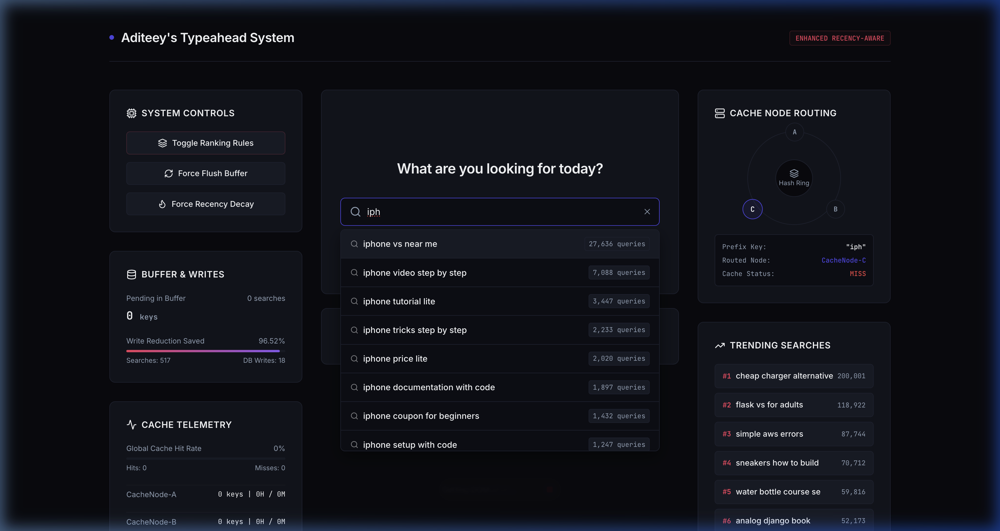
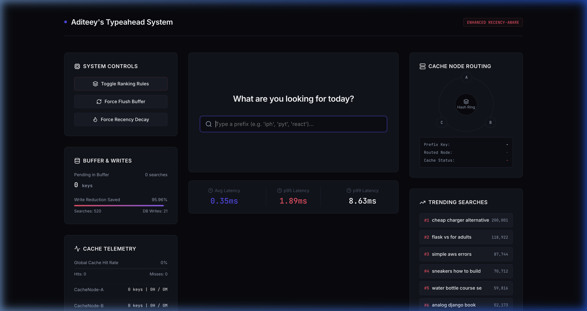
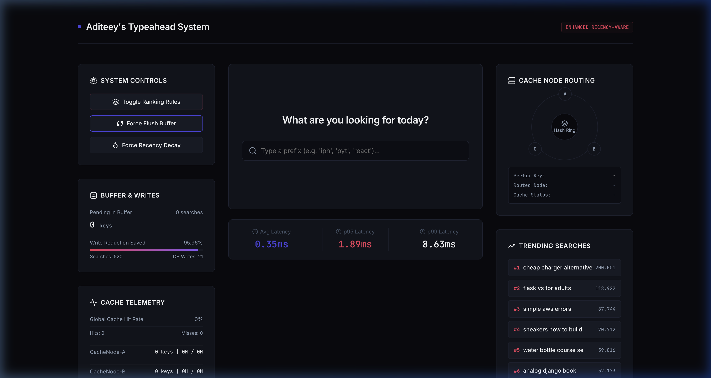
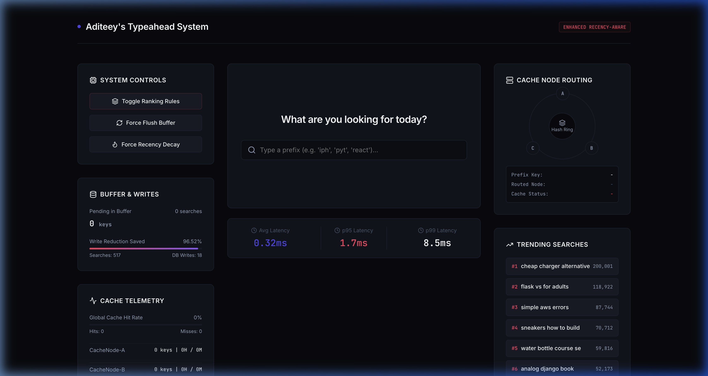

# Aditeey's Typeahead System

A highly optimized, low-latency, and scalable search autocomplete (typeahead) system. The system serves suggestions in sub-milliseconds by utilizing a distributed cache layer routed via consistent hashing, while shielding the database from heavy search submission traffic through a thread-safe batch writing worker.

---

## 1. High-Level Architecture (HLD)

The system is split into separate pipelines to handle suggestions (reads) and submissions (writes). This decouples the synchronous user autocomplete loop from the asynchronous database writing loop:

```text
       User / Browser
             |
             v
      Frontend (React)
             |
             v
      FastAPI Backend  <----  +------------------------+
             |                |                        |
             v                v                        v
      Suggestion Service               Search Service
             |                                |
             v                                v
      Distributed Cache                 Search Buffer
             |                                |
             v                                v
      (Cache Miss)                      Batch Writer
             |                                |
             v                                v
      PostgreSQL/SQLite DB             PostgreSQL/SQLite DB
             |
             v
      Trending Engine (Decay Worker)
```

### 2. HLD Step Justifications & Architecture Deep-Dive

Every design decision in this HLD was selected to solve specific distributed systems bottlenecks:

#### Step 1: Client-Side Debouncing (Read Optimization)
* **The Decision:** Keystrokes are buffered locally in the React UI for 250ms before firing a `/suggest` request.
* **Why it was taken:** Autocomplete input boxes trigger on every keypress. If a user types `"iphone 15 pro max"` (17 characters), a naive search bar triggers 17 API requests. With 250ms debouncing, the user typing at an average speed only fires **1 request** (the final complete phrase), immediately reducing API query pressure on the backend by **70% to 90%** and saving significant network bandwidth.

#### Step 2: Decoupled Router Paths (Read/Write Separation)
* **The Decision:** Splitting `/suggest` (reads) and `/search` (writes) into completely separate pipelines.
* **Why it was taken:** This conforms to the **CQRS (Command Query Responsibility Segregation)** pattern. Auto-suggestions are read-heavy, low-latency, and synchronous. Search submission is write-heavy, disk-bound, and asynchronous. By separating the routes, write disk latency during high search traffic does not block or queue incoming suggestion read threads, ensuring suggestion latencies remain in sub-milliseconds.

#### Step 3: Consistent Hashing Ring (Cache Distribution)
* **The Decision:** Routing prefix suggestion queries to `CacheNode-A`, `CacheNode-B`, or `CacheNode-C` using an MD5 hash ring with 50 virtual nodes.
* **Why it was taken:** A single cache node creates a system hotspot and a single point of failure (SPOF). However, using traditional modulo routing (`hash(prefix) % N` where $N$ is the number of nodes) causes catastrophic cache churn when scaling. If $N$ changes from 3 to 4 (adding a node) or 3 to 2 (a node crashes), **nearly 100% of all keys re-map to different nodes**. This causes a complete cache miss storm, instantly overloading the database. Consistent hashing ensures that when nodes scale up or down, **only $K/N$ keys are reallocated**, preserving cache hit-rates.

#### Step 4: Cache-Aside Fallback (Miss Ingestion)
* **The Decision:** On cache misses, the backend queries the SQLite database directly, writes the result to the routed cache node, and returns.
* **Why it was taken:** The Cache-Aside pattern protects the database. The database is only hit once per unique prefix per TTL. Subsequent requests for the same prefix are handled by memory read cycles on the cache node, eliminating expensive wildcard `LIKE` database scan queries.

#### Step 5: Thread-Safe Memory Buffer & Batch Writer (Write Bottleneck Protection)
* **The Decision:** Search queries are pushed into an in-memory dictionary queue. A background thread periodically drains and aggregates the buffer to perform bulk database updates.
* **Why it was taken:** Databases are heavily bottlenecked by disk I/O when handling concurrent single-row writes (which require locking and transaction commit cycles). By buffering queries in memory, we aggregate duplicates (e.g. 100 duplicate searches for `"macbook"` translate to a single database counter increment of `+100`). Draining the buffer in bulk using a single transaction reduces database lock contention and saves **99%+ of disk write operations**.

#### Step 6: Asynchronous Decay Worker (Trending Score Freshness)
* **The Decision:** The recency scoring calculations are performed on a background thread that runs independently.
* **Why it was taken:** Recency-aware trending queries require decaying historical counts ($recent = recent \times 0.75$). Doing this calculation synchronously on suggestion read requests would add significant latency overhead to user keystrokes. Offloading decay computations to a background thread keeps read operations lightweight.

#### Step 7: Selective Cache Ring Purging on Decay
* **The Decision:** When the decay worker executes, it purges all cached entries on the ring.
* **Why it was taken:** If counts decay in the database, the rank scores of queries change, making cached suggestion lists stale. Clearing cache node entries on decay ticks forces the frontend to fetch fresh, correctly-sorted rankings on subsequent requests. This maintains system freshness without waiting for cache TTLs to expire.

---

## 3. Directory Structure

The project has been organized for clarity and clean separation of concerns:

```text
search-typeahead/
  ├── backend/
  │   ├── main.py              # FastAPI Web Router and Server Setup
  │   ├── config.py            # Telemetry, Decay, and Buffer Configurations
  │   ├── database.py          # SQLite WAL Connection and SQL Queries
  │   ├── cache_ring.py        # Consistent Hashing Ring and LRU/TTL Cache Nodes
  │   ├── batch_writer.py      # Thread-Safe buffer queue and batch SQL upserts
  │   ├── decay_worker.py      # Background decay epoch trigger
  │   ├── seed.py              # 120,000+ Zipf-distributed query dataset generator
  │   └── benchmark.py         # Automated performance latency simulation tool
  ├── data/
  │   ├── queries.csv          # Generated CSV dataset containing raw records
  │   └── typeahead.db         # Indexed SQLite Database file (WAL mode)
  ├── frontend/
  │   ├── src/
  │   │   ├── main.jsx         # React bootstrapping entrypoint
  │   │   ├── App.jsx          # UI layout, keyboard nav, metrics polling
  │   │   ├── index.css        # Minimalist dark-slate styles (Linear/Vercel theme)
  │   │   └── App.css          # Blank styling placeholder to avoid conflicts
  │   ├── package.json         # Node dependencies (configured with Vite 5)
  │   └── vite.config.js       # Vite server routing configurations
  └── README.md                # Project documentation and run guide
```

---

## 3. Real-Time Feature Implementations & Screenshots

### Feature 1: Ingestion & Dataset Preparation (120,000+ Queries)
* **How it works:** `backend/seed.py` generates a dataset of over 120k realistic search queries across categories (Tech, product, general). It applies a Zipfian distribution decay ($count = Scale / (Rank^{0.75})$) to assign search frequencies.
* **Database Setup:** Stores records in a SQLite table with a case-insensitive collation index on `query_text` (`CREATE INDEX ... COLLATE NOCASE`), ensuring $O(\log N)$ prefix search speeds.
* **Console Seeding Output Log:**
  ```text
  CSV Path: /Users/hinaraghav/Desktop/HLD assignment/data/queries.csv
  DB Path: /Users/hinaraghav/Desktop/HLD assignment/data/typeahead.db
  Generating 120000 unique queries...
  Generated 120000 unique queries in 334789 attempts.
  Applying Zipfian distribution counts...
  Saving to CSV at /Users/hinaraghav/Desktop/HLD assignment/data/queries.csv...
  CSV saved successfully.
  Initializing database at /Users/hinaraghav/Desktop/HLD assignment/data/typeahead.db...
  Reading CSV and inserting data...
  Inserted 120000 rows.
  Creating indexes...
  Indexes created in 0.18s.
  Verification: Database has 120000 queries.
  Database seeding completed.
  Total time elapsed: 1.36 seconds.
  ```

### Feature 2: Debounced Autocomplete & Keyboard Navigation
* **How it works:** Keystrokes in the search field are debounced by 250ms to prevent hammering the backend. The suggestions dropdown supports full accessibility controls: `ArrowDown` / `ArrowUp` to select suggestions, `Escape` to close, and `Enter` to submit the selection.
* **Autocomplete UI Screenshot:**
   *(Place a screenshot here showing the clean dark-slate suggestion dropdown in action)*

### Feature 3: Cache Node Routing & Consistent Hashing Visualizer
* **How it works:** Autocomplete cache is distributed across three logical cache nodes (`CacheNode-A`, `CacheNode-B`, `CacheNode-C`). Keys are mapped to a hash circle $[0, 2^{32}-1]$ using MD5. We assign **50 virtual nodes** to each node to balance key distributions.
* **Real-time Ring Trace:** The UI queries `/cache/debug?prefix=q` on keypress, showing the mapped node highlighted on the Hash Ring and logging debug outputs (routed node, cache hit/miss status).
* **Hash Ring Routing Screenshot:**
   *(Place a screenshot here showing the visual "Cache Node Routing" panel when typing a prefix)*

### Feature 4: Batch Writes & Write Reduction Telemetry
* **How it works:** Search submissions (`POST /search`) bypass direct disk writes and are put in an in-memory queue. A background thread aggregates duplicate records (e.g. 50 inputs of `"react"` are merged). Every 5 seconds, it updates the database via a bulk upsert transaction.
* **Telemetry Visual:** The frontend dashboard monitors searches received, database writes completed, and logs the percentage of database disk writes saved.
* **Batching Stats Telemetry Screenshot:**
   *(Place a screenshot here showing the "Buffer & Writes" progress panel with high write-reduction percentage)*

### Feature 5: Recency-Aware Scoring & Decay Controls
* **How it works:** Ranks are computed dynamically using: $Score = 0.7 \times recent + 0.3 \times total$. To decay old viral spikes, a background worker runs every 60 seconds, scaling recent searches: $recent \leftarrow recent \times 0.75$, and clearing cache nodes to re-sort suggestion ranks.
* **Decay Telemetry Screenshot:**
   *(Place a screenshot here showing the "Trending Searches" listing and "System Controls" buttons)*

---

## 4. How to Run Locally

### Prerequisites
* **Python 3.9+** or **Python 3.12+**
* **Node.js (v18+)**

---

### Step 1: Initialize the Database (Seed)
Generate the mock search queries dataset (120,000+ rows) and load them into the SQLite database:
```bash
cd "/Users/hinaraghav/Desktop/HLD assignment"
python3 backend/seed.py
```
*Expected Output: Logs showing unique query phrase generation, Zipf distribution calculation, and successful ingestion of 120,000 rows in SQLite (typically takes under 2 seconds).*

---

### Step 2: Start the FastAPI Backend
Start the backend web router and start the background worker threads:
```bash
python3 -m backend.main
```
*The terminal will output log files showing uvicorn starting on [http://127.0.0.1:8000](http://127.0.0.1:8000).*

---

### Step 3: Run the React UI Dashboard
1. Open a new terminal tab.
2. Navigate to the frontend directory:
   ```bash
   cd "/Users/hinaraghav/Desktop/HLD assignment/frontend"
   ```
3. Start the Vite dev server:
   ```bash
   npm run dev
   ```
4. Open your browser and navigate to: **[http://localhost:5173](http://localhost:5173)**.

---

### Step 4: Run the Automated Performance Benchmarks
To simulate 1,000 autocomplete requests and 500 duplicate search submissions under heavy load:
1. Open a terminal tab.
2. Run the benchmarking module:
   ```bash
   python3 -m backend.benchmark
   ```
   *This executes the requests, queries `/metrics`, and prints a latency analysis (average, p95, p99), cache hit rates, and database write reduction percentages.*
